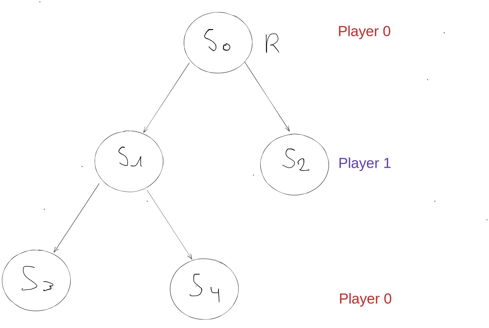

# AI Projects Adrien PELFRESNE | Alexis VAPAILLE
## Introduction
> "*The aim of this project is to present how a game AI, using deep learning tools
> could win against the greatest chess or Go champions.
> We will use a game that is easy to learn but with a high degree of combinatorics (**domineering**).
> In this tutorial, we will build different generations of algorithms until we reach a method using deep learning.
> At each step, a more powerful AI will be built.
> You will set up a **competitive game mode** where you will compare the performance of this new AI against the old one.*"

##### [checkout source page for this project](https://perso.esiee.fr/~buzerl/IA/330%20Projet_3/ProjetIAetJeux.html)
##### [play domineering](https://staff.fim.uni-passau.de/kreuzer/Spielesammlung/Spielesammlung/Domineering/index.html)

### Run Instructions
```
$ git clone https://github.com/dirdr/ia_e3 && cd ia_e3
$ python3 -m pip install -r "requirements.txt"
$ python3 src/main.py
```

### Usage
o create a battle, go to `src/main.py` and edit the main function
create a battle object and pass two player.
then call the `full_battle` method.
the match result will be printed when the match is over

### Classic Monte carlo
The classic Monte-Carlo method can be broken down into   simple steps.  
When it is time for the monte carlo agent to play a move,
the algorithm will iterate through all avaibles moves and simulate $n$ games for each moves
it will then select the move with the highest mean for all the simulations

### MCTS (Monte carlo tree search)

#### Notation  
$R$ is the root of the stats tree  
$L$ is a leaf node (a node with no known children so far)

#### Steps
The Monte carlo tree search algorithm can be broken down into 4 steps :
- **Selection**  
Algorithm starts at root node $R$, then moves down the tree by selecting optimal child
(using UCT formula)
node until a leaf node $L$  is reached.

- **Expansion**  
If $L$ is a not a terminal node (it does not terminate the game)
then create one or more child nodes according to available actions at the current state (node),
then and select the first of these new nodes $M$.

- **Simulation**  
Run a simulated rollout from $M$ until a terminal state is found. The terminal state contains
a result (value) that will be returned to upwards in the is backpropagation phase.
NB. The states or nodes in which the rollout passes through are not considered visited.

- **Backpropagation**  
After the simulation phase, a result is returned.
All nodes from $M$ up to $R$ will be updated by adding the result to their value
and increase the count of visits at each node.

#### UCT
The **Upper confidence Trees** (UCT) formula
$$S_i = x_i + c \sqrt{\frac{ln(n)}{n_i}}$$  
**Where**
- $x_i$ is the mean of all the game passing through this node.
In our case
- $n_i$ is the number of simulation that passed through this node
- $c$ is a a coefficient that allows us to adjust the balance between exploration and exploitation 
- $n$ number of simulation passed by the parent node

#### Handle two players
Something to not forget when implementing the mcts algorithm for a two player game is **result switching**.  
We can see in this schema that if the player 0 start to chose his move at root,
then one layer under, it will be player 1 turn
we try to maximise to opponent moves. so when selecting the best child for the opponent,
we need to take our player looses (which is the opponent wins)
  


### References
[A really well written article that describe MCTS steps](https://towardsdatascience.com/monte-carlo-tree-search-in-reinforcement-learning-b97d3e743d0f)  
[MCTS-Survey](http://www.incompleteideas.net/609%20dropbox/other%20readings%20and%20resources/MCTS-survey.pdf)  
[A nice blog post about MCTS](https://jyopari.github.io/MCTS.html)
